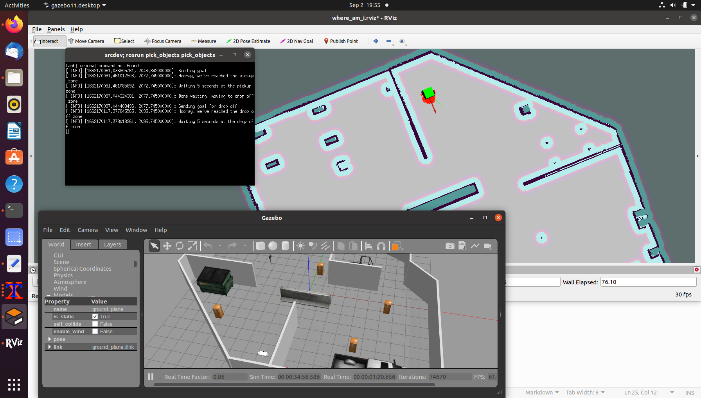

Home Service Robot
==============================================

This project contains a number of scripts that kick off a robot inside a gazebo world and a corresponding rviz environment. The scripts are as follows:

**test_slam.sh**
Creates a map of the environment using the gmapping plugin. The robot is moved around using the teleop package.

**test_navigation.sh**
Uses an existing map with the amcl algorithm to localize within the map.

**pick_objects.sh**
Created a pick_objects package that sends a pick up and drop off goal for the robot including pausing for 5 seconds after reaching the goals.

**add_marker.sh**
Created an add_marker.sh to emulate a package at the pick up and drop off points. The package behavior is linked to the robot position. i.e. it disappears when leaving the pick up goal and reappears when reaching the drop off goal.

**home_service**
Combines all features into a final .sh script.

Drop Off Point

-----------
